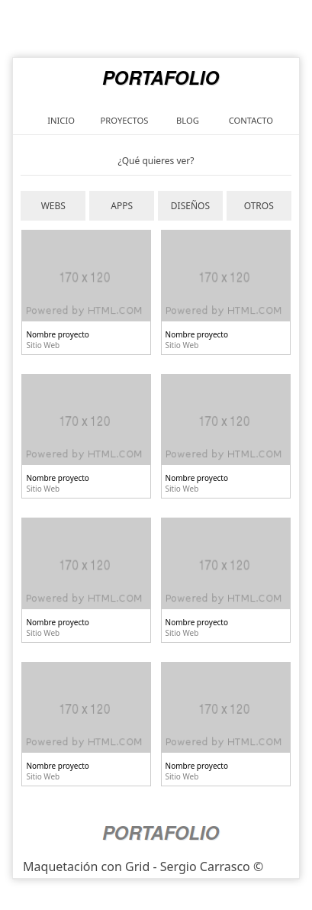

# Portfolio Grid Layout
---
## What is Portfolio Grid Layout? 🤔

It is a simple but effective responsive web design created from a jpg image. HTML5 and CSS3 are used, as well as Grid as the layout technology. It can serve as a basis for other more elaborate designs portfolios

---
## Technologies used 🛠️
- HTML
- CSS
- Visual Studio Code
- Git/Git Hub
---
## Do you want to see the application running? 🚀

 [Click here!](https://scarrasco85.github.io/-portfolio-layout-grid/index.html)

---
 ## Responsive views - Some examples
#### Desktop view:

---
***

#### Medium view:

---
***

#### Medium view 2 - 670px:

---
***

#### Small view - 599px:

---
***

#### Small view 2 - 409px:

---
***

#### Small view 3 - 390px:

---
***

#### Small view 4 - 300px:

---
***